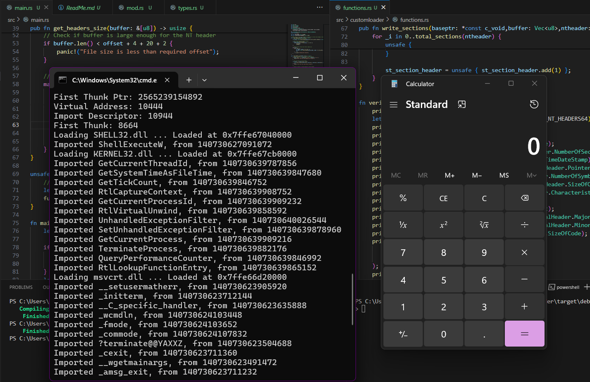

# PE_Loader

### A custom portable executable (PE) loader written in Rust (just an experiment)

**Note:** This project is for educational purposes only! Please refrain from using its code in custom malicious applications.

Currently, the build of this loader is able to do the following:

- Check if the file is a supported executable using Headers.
- Resolve `ntheader` info & read Signature, File Header, NumberOfSections, TimeDateStamp, Optional Header, SizeOfInitializedData, etc.
- Read DLL imports from `ntheader`.
- Load the required DLLs & import the required functions.
- Perform Base Relocations, so that the functions work as intended.

**tl;dr**

It can execute (or say load into memory) simple programs(like calc.exe, etc..) along with required dll's , independently, without being detected by Windows Defender, etc. (As of 17/5/2024)

### Instructions

#### For testing

- Clone this repository
- Run the following command `.\PE_Loader.exe calc.exe` in the terminal from the demo directory

#### For Building it yourself

- Install cargo: refer [Rust's official documentation](https://doc.rust-lang.org/cargo/getting-started/installation.html)
- Clone this repository
- Run `cargo build` in Terminal
- Change directory to `.\target\debug\`
- Execute the loader using `.\PE_Loader.exe <location_of_executable>` eg. `.\PE_Loader.exe ..\..\demo\calc.exe`

### About Development

It's just ~300 lines, but the efforts this thing took is just crazy, but yet awesome though.

This project was created by me (& some help from GPT) during my 6th semester, mainly during Jan,Feb '24, just out of curiosity to learn how Windows executables are loaded by the OS.

The main aim was to learn programming in Rust while also learning how Win APIs & memory handling are done.

**Note:** 
- Currently, it only works with simple applications; large applications don't work as of now.
- The allocated memory region has RWX permissions, will change it soon.
- The dev version of this build is in my private repo. Since, I'm planning to add calling syscalls via direct assembly instructions compiled using NASM.